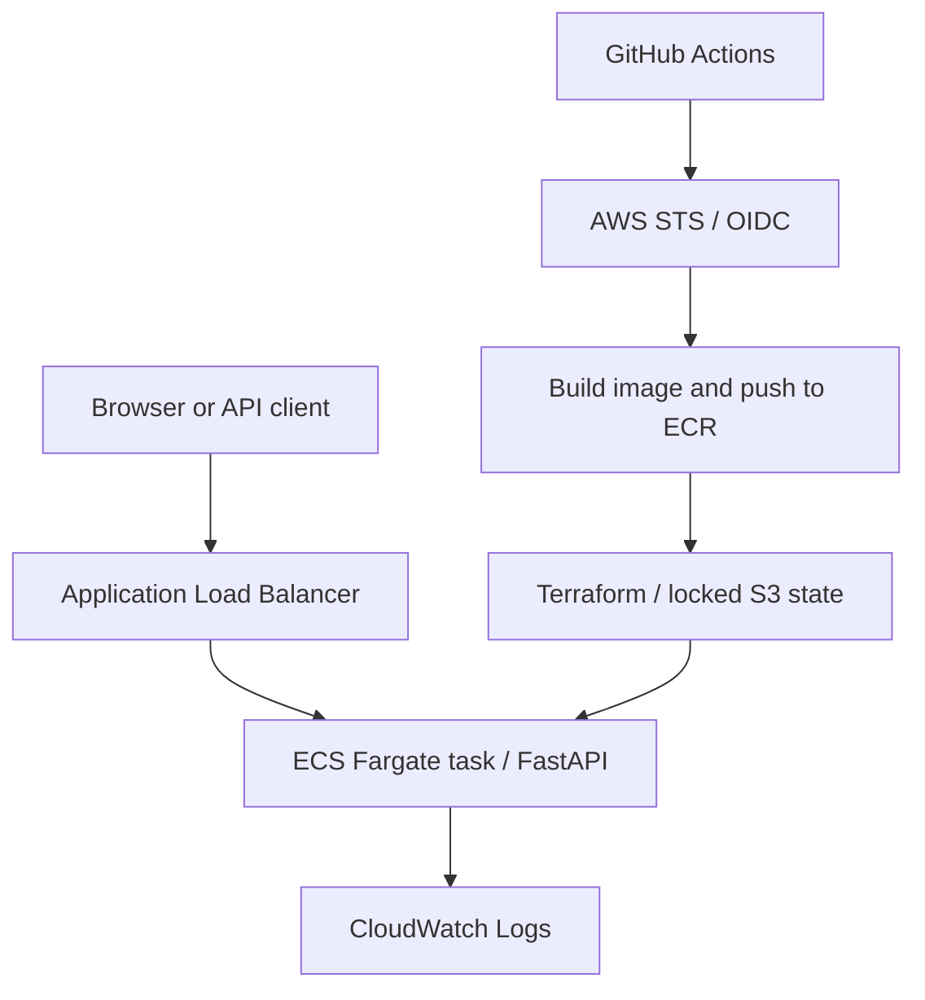

# ECS Fargate Platform - Cloud Deployment & IaC Automation

A small FastAPI service deployed through Terraform to AWS ECS Fargate behind an Application Load Balancer. GitHub Actions authenticates through AWS OIDC, builds an immutable ECR release, updates the Terraform-managed task definition and service, and verifies the actual application revision.

This is a portfolio lab, not a claim of a production deployment. See [verification status](docs/VERIFICATION.md) for checks actually executed.

## Architecture



Two public subnets span two availability zones. Tasks have public IPs for outbound ECR/logging connectivity; their application port only accepts the ALB security group. This avoids a NAT gateway for a short lab, but is a deliberate tradeoff. One task is the default, so two subnets do not imply highly available running capacity. Production designs may use private subnets and NAT or VPC endpoints.

## Features

- Stateless FastAPI API, small responsive release dashboard, readiness/liveness endpoints, request IDs, JSON request logs, and Prometheus-format metrics.
- Multi-stage non-root Docker image; read-only runtime filesystem and dropped capabilities.
- Terraform bootstrap: versioned/encrypted/private S3 state bucket, immutable/scanned ECR repository, GitHub OIDC trust, deployment role, scoped execution role, unprivileged application task role.
- Terraform workload: VPC/subnets/routes, ALB/IP target group, task definition/service, log group and metric alarms. Optional ACM HTTPS listener with a matching custom hostname.
- CI: Python checks/tests, Terraform validation and mock-provider plans, container build and smoke checks. These require no AWS account.
- Deployment: manual plan/apply/rollback/destroy; optional automatic main-branch release; SHA tags and digest-pinned task definitions; exact deployment receipts.

## Run locally

```sh
docker compose up --build -d
docker compose ps
docker compose logs api
```

Open <http://localhost:8000>. API docs are at `/docs`, and `/api/info` identifies the served revision.

Without Docker, from the repository root:

```sh
python -m venv .venv
# Git Bash/Linux/macOS:
source .venv/bin/activate
# Windows Git Bash instead: source .venv/Scripts/activate
python -m pip install -e '.[dev]'
uvicorn app.main:app --host 127.0.0.1 --port 8000 --no-access-log
```

## Checks

```sh
python -m pytest -q
python scripts/http_smoke.py
ruff check .
ruff format --check .
terraform fmt -check -recursive infra
terraform -chdir=infra/bootstrap init -backend=false -lockfile=readonly
terraform -chdir=infra/bootstrap validate
terraform -chdir=infra/bootstrap test
terraform -chdir=infra/workload init -backend=false -lockfile=readonly
terraform -chdir=infra/workload validate
terraform -chdir=infra/workload test
```

Terraform is pinned to 1.13.5 in CI; the AWS provider is pinned to 6.46.0 with committed lock files. Mock tests check the configuration and do not deploy AWS resources.

## Deploy to AWS

Follow [SETUP.md](docs/SETUP.md). This requires your own AWS account/session, a repository, and a protected `aws-demo` GitHub environment. Do not share AWS access keys in chat. No long-lived AWS secrets are needed in GitHub Actions. The initial bootstrap is performed by an authorized local AWS operator.

AWS resources incur charges. Review the Terraform plan and [cleanup instructions](docs/OPERATIONS.md), and destroy the workload when done. Auto-deployment is disabled until `ENABLE_AUTO_DEPLOY=true` is explicitly configured.

## Repository map

| Path | Purpose |
| --- | --- |
| `app/` | Stateless API and browser workspace |
| `infra/bootstrap/` | Persistent account/release foundations, locally owned state |
| `infra/workload/` | Workload resources, remote state, immutable image releases |
| `.github/workflows/ci.yaml` | Checks without AWS credentials |
| `.github/workflows/inspect-oidc.yaml` | Shows the actual non-secret OIDC subject |
| `.github/workflows/deploy.yaml` | AWS plan/apply/rollback/destroy |
| `scripts/` | Image resolution, rollout checks, setup export, browser smoke |
| `docs/` | Setup, operations, architecture decisions, interview notes, evidence |

## API

| Method | Endpoint | Purpose |
| --- | --- | --- |
| GET | `/` | Deployment dashboard |
| GET | `/api/info` | Version, environment, commit revision |
| POST | `/api/capacity` | Resource arithmetic across tasks, not pricing or task-size validation |
| GET | `/healthz`, `/readyz` | Process health and readiness; stateless service has no runtime dependency |
| GET | `/metrics` | Aggregate application metrics; no scraper/dashboard is provisioned |

The demo exposes no application secrets and has no user database or authentication. Do not add sensitive functionality behind the public HTTP listener without redesigning that boundary.

## Interview preparation

Read [INTERVIEW.md](docs/INTERVIEW.md) for a simple pitch, tradeoffs, and questions. Say “deployed on AWS” only after a real rollout and HTTP verification succeed. The deployment receipt is designed to support that claim.

MIT licensed. Developed with AI assistance; personal review and actual deployment evidence should accompany portfolio claims.
